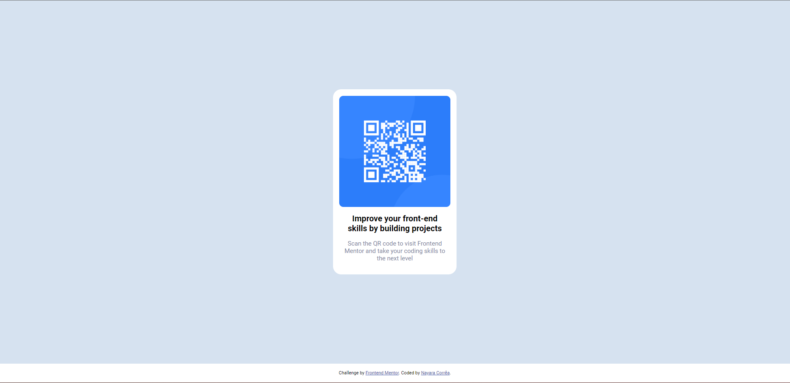

# Frontend Mentor - QR code component solution

This is a solution to the [QR code component challenge on Frontend Mentor](https://www.frontendmentor.io/challenges/qr-code-component-iux_sIO_H). Frontend Mentor challenges help you improve your coding skills by building realistic projects.

## Table of contents

- [Overview](#overview)
  - [Screenshot](#screenshot)
  - [Links](#links)
- [My process](#my-process)
  - [Built with](#built-with)
  - [What I learned](#what-i-learned)
  - [Continued development](#continued-development)
  - [Useful resources](#useful-resources)
- [Author](#author)
- [Acknowledgments](#acknowledgments)

## Overview

### Screenshot

- Desktop
  

### Links

- Solution URL: [Click here](https://www.frontendmentor.io/solutions/qr-code-component-Bk3a7Crlzs)
- Live Site URL: [Click here](https://qr-code-component-main-beta-nine.vercel.app/)

## My Process

### Built with

- Semantic HTML5 markup
- CSS custom properties
- Flexbox
- CSS Grid

### What I learned

During this challenge I was able to learn a little more about the basics of HTML and CSS

### Continued development

For the future, the idea is to prioritize the understanding of Grid and Flexbox.
In addition to exploring the possibilities that CSS provides in code development.

### Useful resources

- [Flex Container](https://origamid.com/projetos/flexbox-guia-completo/) - This site helped me a lot to understand the concepts of Flex Container and the best way to use it.

## Author

- Frontend Mentor - [@nayaracorrea](https://www.frontendmentor.io/profile/nayaracorrea)
- Linkedin - [Nayara Corrêa](https://www.linkedin.com/in/nayaracorreaflorentino/)
